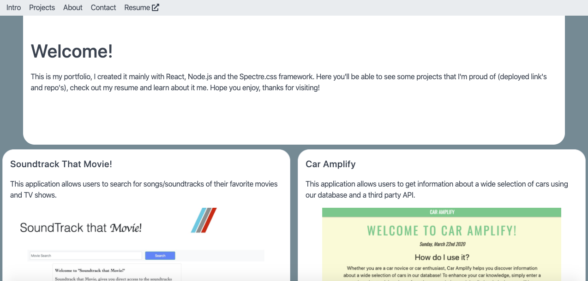

# React-Portfolio
## Description: 
This is my personal portfolio created in React.
## Table Of Contents:
* How To Use
* Technology Used/Badges

## How To Use:
Simply travel to the website by clicking the provided deployed link and once there, click on the project links to check out my work.

## Technologies Used/Bagdes: 
 
## Lisence:  
MIT
